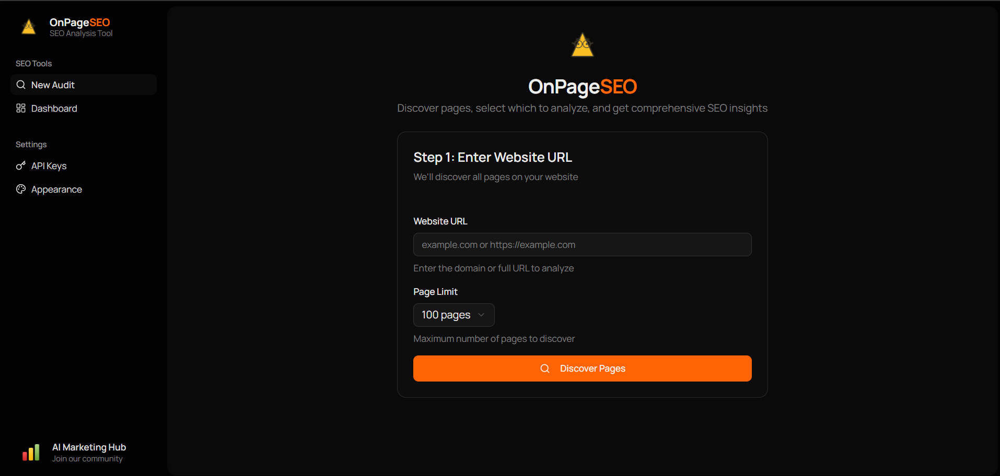

# On-Page SEO Analyzer

A comprehensive on-page SEO analysis tool that helps you audit and optimize your website's SEO performance. Analyze up to 500 pages at once with detailed insights on 74 SEO metrics.



## Features

- **Page Discovery**: Automatically discover pages on your website using Firecrawl
- **Comprehensive Analysis**: Analyze 74 SEO metrics per page using DataForSEO
- **Core Web Vitals**: Track LCP, FID, and CLS scores
- **Real-time Progress**: Watch your audit progress with live updates
- **Export Results**: Download reports as CSV or JSON
- **Dark Mode**: Full dark mode support

## Tech Stack

**Frontend:**
- React 19 with TypeScript
- Vite for blazing fast builds
- TanStack Router & React Query
- Tailwind CSS with Shadcn/ui components
- Recharts for data visualization

**Backend:**
- Node.js with Express
- SQLite database (better-sqlite3)
- TypeScript
- Firecrawl API for page discovery
- DataForSEO API for SEO analysis

## Prerequisites

- Node.js 18+
- npm or yarn
- [Firecrawl API Key](https://firecrawl.dev)
- [DataForSEO Account](https://dataforseo.com)

## Quick Start

### 1. Clone the repository

```bash
git clone https://github.com/yourusername/on-page-seo.git
cd on-page-seo
```

### 2. Install dependencies

```bash
# Install all dependencies (root, client, and server)
npm run install:all
```

### 3. Configure environment

```bash
cp .env.example .env
```

Edit `.env` with your settings, or configure API keys through the app's settings page.

### 4. Start development servers

```bash
npm run dev
```

This starts both the client (http://localhost:3005) and server (http://localhost:3001).

## Scripts

| Command | Description |
|---------|-------------|
| `npm run dev` | Start both client and server in development mode |
| `npm run dev:client` | Start only the client |
| `npm run dev:server` | Start only the server |
| `npm run build` | Build both client and server for production |
| `npm run start` | Start the production server |
| `npm run install:all` | Install dependencies for root, client, and server |

## Project Structure

```
on-page-seo/
├── client/             # React frontend
│   ├── src/
│   │   ├── components/ # Reusable UI components
│   │   ├── features/   # Feature-based modules
│   │   ├── lib/        # API client and utilities
│   │   ├── routes/     # TanStack Router routes
│   │   └── types/      # TypeScript types
│   └── ...
├── server/             # Express backend
│   └── src/
│       ├── routes/     # API routes
│       ├── services/   # Business logic
│       └── db/         # Database layer
├── shared/             # Shared types
│   └── types/
├── data/               # SQLite database
└── ...
```

## API Endpoints

| Method | Endpoint | Description |
|--------|----------|-------------|
| POST | `/api/audits` | Start a new SEO audit |
| GET | `/api/audits` | List all audits |
| GET | `/api/audits/:id` | Get audit details with results |
| GET | `/api/audits/:id/progress` | SSE stream for real-time progress |
| GET | `/api/audits/:id/export` | Export audit as CSV or JSON |
| DELETE | `/api/audits/:id` | Delete an audit |
| GET | `/api/settings` | Get API configuration status |
| PUT | `/api/settings` | Update API credentials |

## Production Deployment

### Build for production

```bash
npm run build
```

### Start production server

```bash
NODE_ENV=production npm run start
```

The server will serve the built client files and handle API requests on the same port.

## Contributing

Contributions are welcome! Please feel free to submit a Pull Request.

## License

This project is licensed under the MIT License - see the [LICENSE](LICENSE) file for details.
